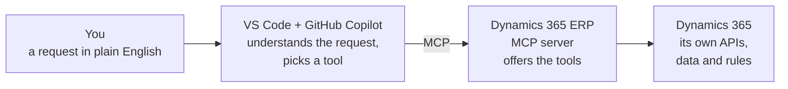

# How MCP works with Dynamics 365: a worked example

*Optional reading, about 5 minutes. You don't need this to complete the exercise.*

## The chain, from your sentence to Dynamics 365



- **You** ask for something in plain language.
- **Copilot** (inside VS Code) works out what you need and which tool can do it.
- **The MCP server** offers Dynamics 365's tools to Copilot and passes each request on.
- **Dynamics 365** does the actual work, with your permissions, and sends back the result.

## Reading versus writing

| | Reading | Writing |
|---|---|---|
| What it does | Looks up orders, vendors, items; answers questions | Creates or changes records |
| Example tools | `data_find_entities` | `data_create_entities`, `data_update_entities` |
| Risk | Low: a good place to start | Medium: always needs a person to check first |

## Example 1: a read request, step by step

A purchasing colleague wants a quick overview. They type:

> *"Show me the open purchase orders for vendor US-104 in USMF and their total value."*

| Step | What happens |
|---|---|
| Copilot | Understands this is a lookup and chooses the "find records" tool. |
| MCP server | Asks Dynamics 365, through its API, for purchase orders from vendor US-104 that are still open. |
| Dynamics 365 | Returns the matching orders, with dates, items, and amounts. |
| Copilot | Shows them as a readable table with a total, and offers to dig deeper. |

Without MCP, that's a few minutes of signing in, navigating, filtering, and exporting. With MCP, it's one sentence and a few seconds.

## Example 2: a write request (what you did in the exercise)

Creating a record follows the same chain, with one extra stop: **you**.

1. You paste the request (in our case, Sam's email).
2. Copilot picks out the key details.
3. Copilot shows a **preview** of the order.
4. **You check it and confirm.**
5. Only then does Copilot use the "create records" tool, and Dynamics 365 creates the order.

Doing this by hand takes roughly 15–20 minutes per order. With MCP and a careful check, it's a few minutes, and a person still makes the final call.

## What the connection looks like

The whole connection is one small settings file, `.vscode/mcp.json`. It only holds the address of the Dynamics 365 environment:

```jsonc
{
  "servers": {
    "d365-erp": {
      "type": "http",
      "url": "https://your-environment.sandbox.operations.dynamics.com/mcp"
    }
  }
}
```

There are no passwords in it. Everyone signs in with their own Dynamics 365 account, so Copilot can only ever do what that person is already allowed to do.
